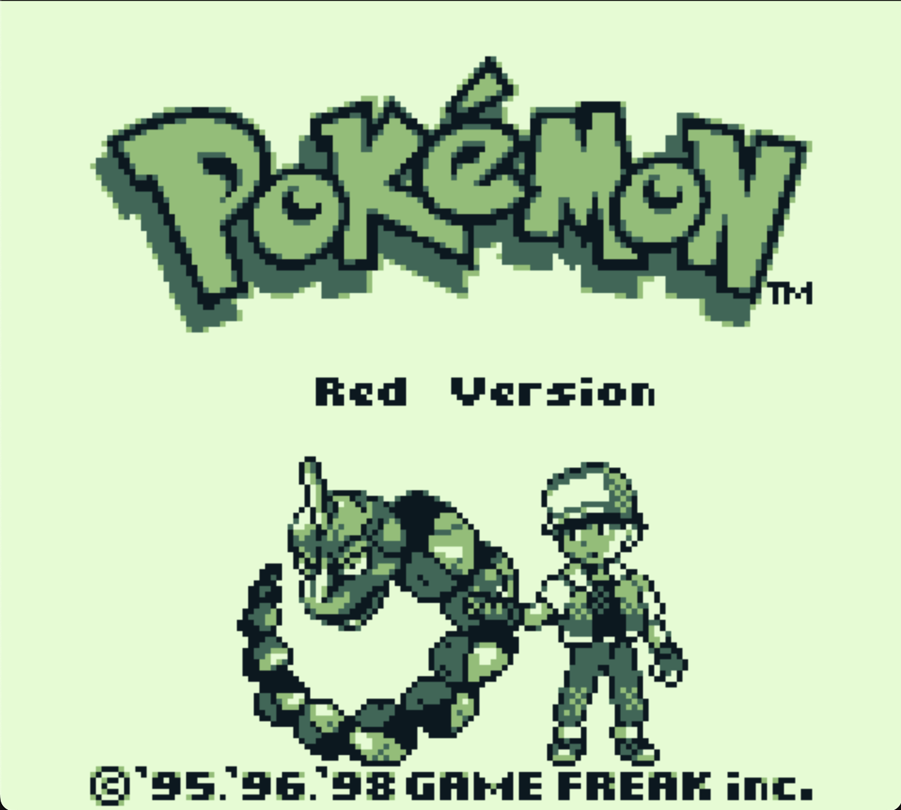
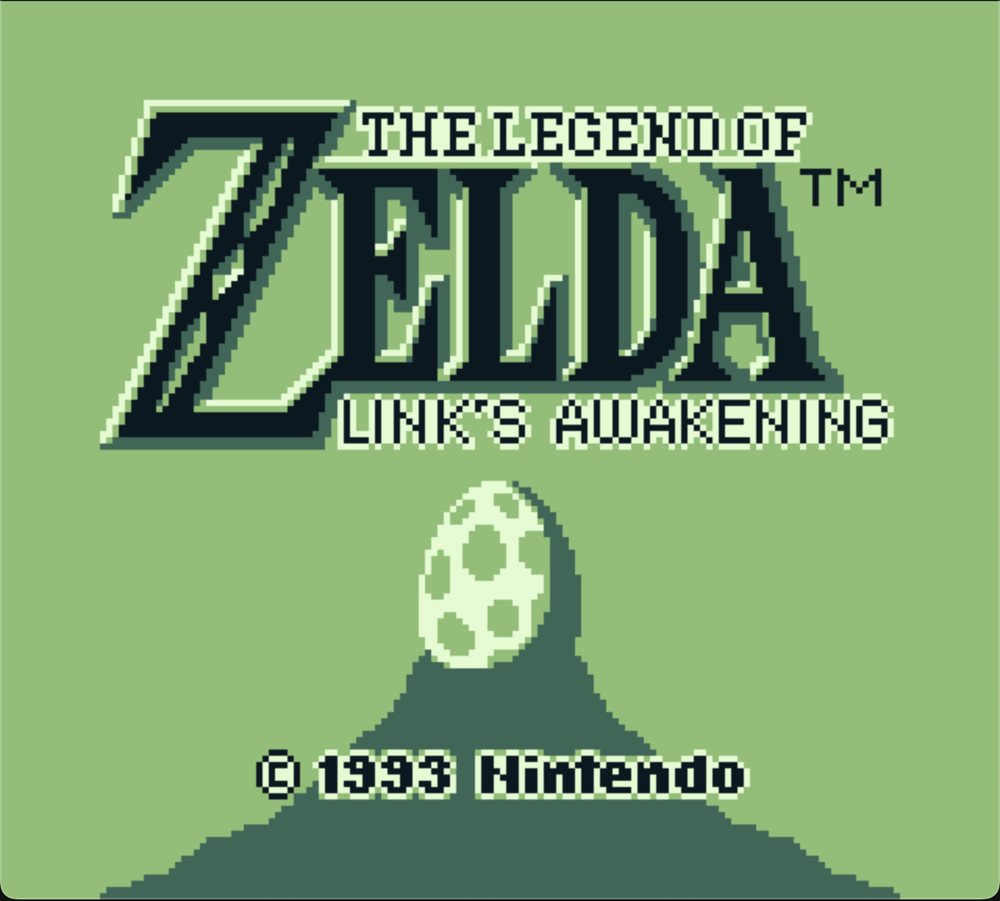
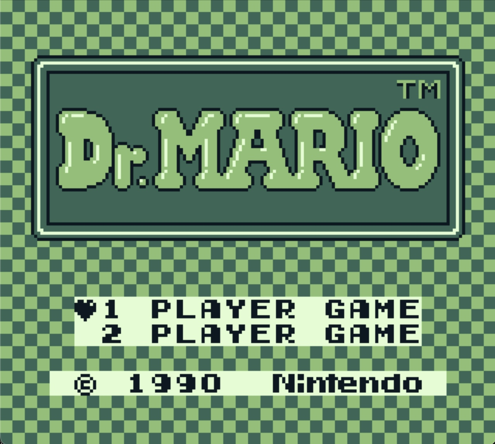
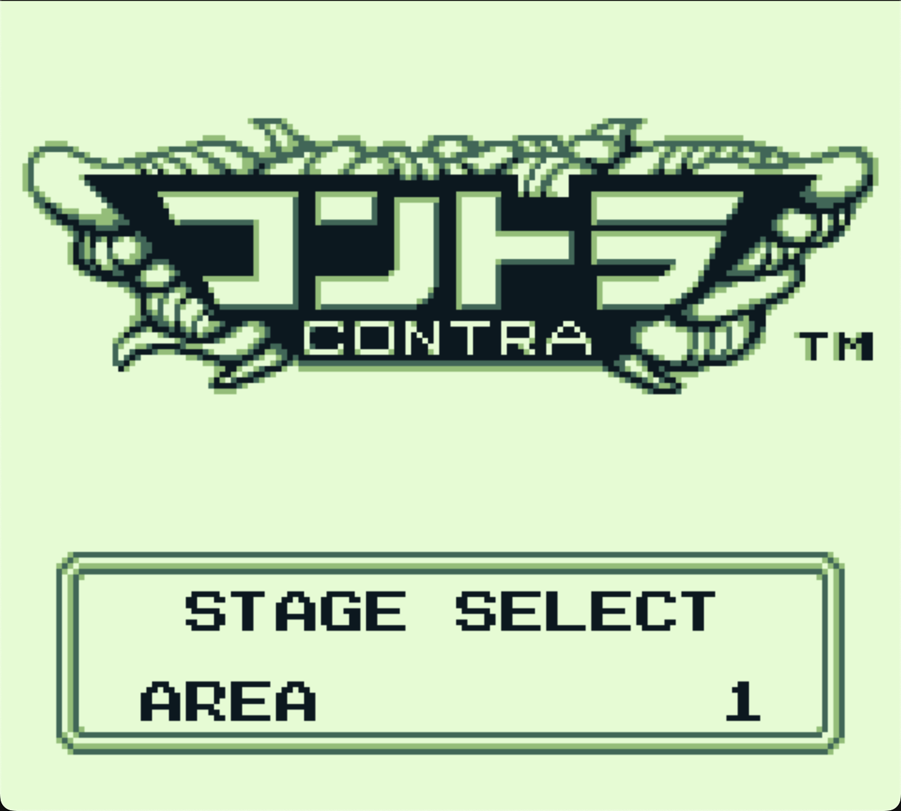
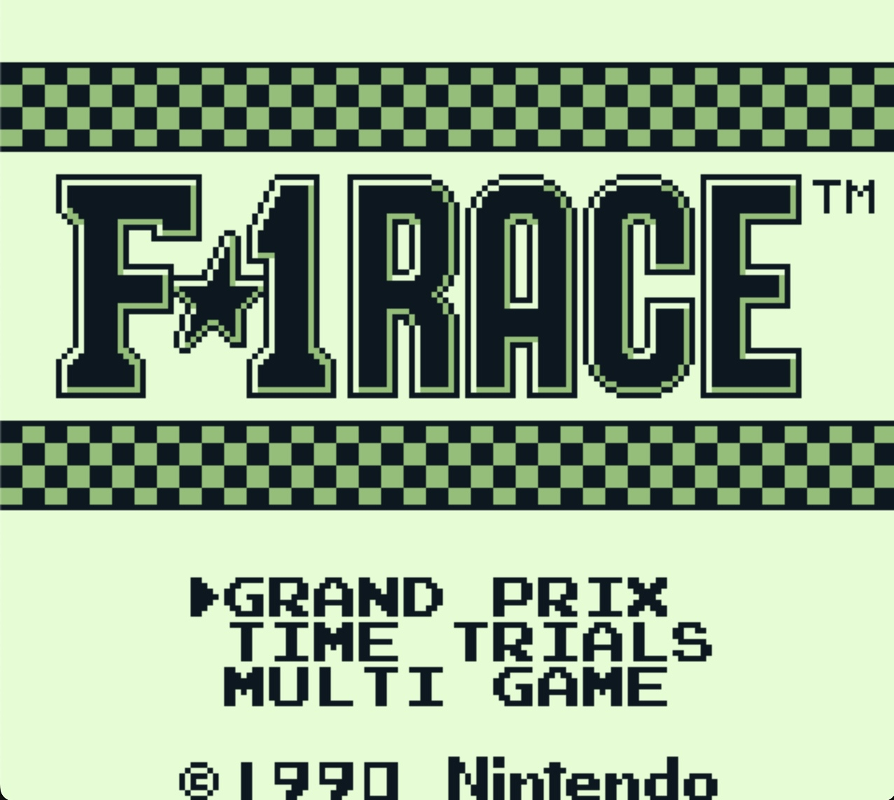

⚠️ Readme WIP ⚠️

# VGBoy

VGBoy (Virtual Game Boy): A Game Boy (DMG) emulator written fully in C, with SDL2 frontend to manage graphics and audio.
This is a perrsonal project that served as a learning opportunity for me to get into emulator development.

<div align="center">
  
  
  
</div>
<div align="center">
  
  
</div>

## Features

- Game Boy (DMG) emulation support
- MBC1, MBC2, MBC3, and MBC 5 ROM support
- Battery save
- PPU Rendering with pixel pipeline
- Audio emulation

## In the Works

- RTC Support
- MBC6, MBC7, HuC-1 ROM support
- Save state / rewind feature
- Higher timing accuracy

# Compilation

## Dependencies

- [CMake](https://cmake.org/): Building
- [Simple DirectMedia Layer (SDL) 2.0](https://wiki.libsdl.org/SDL2/FrontPage): Graphics, audio, and keyboard input
- [Ceedling](https://www.throwtheswitch.org/ceedling) + [gcovr](https://github.com/gcovr/gcovr): Unit testing

## Setup & Build

```sh
# Setup
git clone https://github.com/Kadinata/VGBoy.git
cd VGBoy
mkdir bin

# Build
cd bin
cmake ..
make clean
make
```

## Running the Emulator

```sh
./VGBoy path/to/game_rom.gb
```

## Unit Testing

```sh
./run_test.sh  # Runs all tests
./run_test.sh path/to/test_file.c # Runs a single test file
```

### Key Mapping

| Keyboard | Game Boy |
| :--- | :--- |
| `W` | `UP` |
| `A` | `LEFT` |
| `S` | `DOWN` |
| `D` | `RIGHT` |
| `K` | `B` |
| `L` | `A` |
| `ENTER` | `START` |
| `BACKSPACE` | `SELECT` |

# Additional Resources

- [Game Boy Pan Docs](https://gbdev.io/pandocs/About.html)
- [Game Boy CPU opcode table](https://meganesu.github.io/generate-gb-opcodes/)
- [Game Boy Development Wiki](https://gbdev.gg8.se/wiki/articles/Main_Page)
- [NightShade's Game Boy Sound Emulation Primer](https://nightshade256.github.io/2021/03/27/gb-sound-emulation.html)
- [Hacktix's Game Boy PPU Primer](https://hacktix.github.io/GBEDG/ppu/)
- [Low-Level Devel's Game Boy Emulator Dev Series](https://www.youtube.com/playlist?list=PLVxiWMqQvhg_yk4qy2cSC3457wZJga_e5)

Special thanks to the super helpful folks at the [EmuDev Discord](https://discord.com/invite/dkmJAes)!
